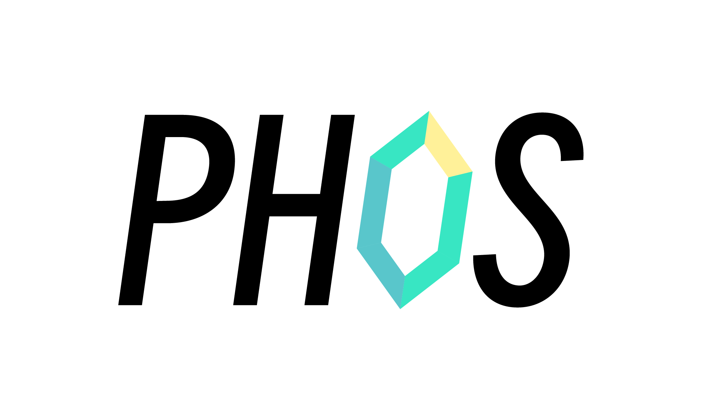

# PHOS

[](https://goreportcard.com/report/github.com/B1NARY-GR0UP/phos)

> You Can (Not) Redo



PHOS is a channel with internal handlers and diversified options.

## Install

```shell
go get github.com/B1NARY-GR0UP/phos
```

## Quick Start

```go
package main

import (
    "context"
    "fmt"

    "github.com/B1NARY-GR0UP/phos"
)

func hello(_ context.Context, data string) (string, error) {
    return data + "-PHOS", nil
}

func main() {
    ph := phos.New[string]()
    defer close(ph.In)
    ph.Handlers = append(ph.Handlers, hello)
    ph.In <- "BINARY"
    res := <-ph.Out
    fmt.Println(res.Data)
}
```

## Configuration

| Configuration        | Default                | Description                                                                          | Example                 |
|----------------------|------------------------|--------------------------------------------------------------------------------------|-------------------------|
| `WithContext`        | `context.Background()` | Set context for PHOS                                                                 | [example](phos_test.go) |
| `WithZero`           | `false`                | Set zero value for return when error happened                                        | [example](phos_test.go) |
| `WithTimeout`        | `time.Second * 3`      | Set timeout for handlers execution                                                   | [example](phos_test.go) |
| `WithErrHandleFunc`  | `nil`                  | Set error handle function for PHOS which will be called when handle error happened   | [example](phos_test.go) |
| `WithErrTimeoutFunc` | `nil`                  | Set error timeout function for PHOS which will be called when timeout error happened | [example](phos_test.go) |
| `WithErrDoneFunc`    | `nil`                  | Set err done function for PHOS which will be called when context done happened       | [example](phos_test.go) |

## License

PHOS is distributed under the [Apache License 2.0](./LICENSE). The licenses of third party dependencies of PHOS are explained [here](./licenses).

## END

PHOS is a subproject of the [BINARY WEB ECOLOGY](https://github.com/B1NARY-GR0UP)